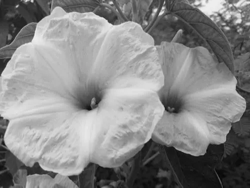
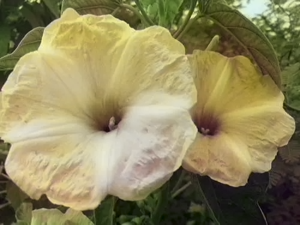
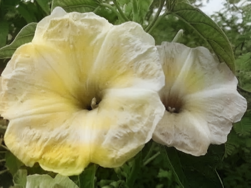

# 🖼️ Image Colorizer - Deep Learning based Grayscale Image Colorization

This project uses deep learning models to automatically colorize black and white (grayscale) images using pretrained networks from ECCV 2016 and SIGGRAPH 2017. It offers both a command-line interface (CLI) and a graphical user interface (GUI) for image selection and processing.

---

## 📌 Features

- ✅ Colorizes grayscale images using:
  - ECCV 2016 model
  - SIGGRAPH 2017 model
- ✅ CLI for batch/single image processing
- ✅ GUI for easy image selection and preview
- ✅ GPU support for faster performance (optional)

---

## 📁 Project Structure

```
image-colorizer/
│
├── colorizers/             # Model definitions
│   ├── __init__.py
│   ├── base_color.py
│   ├── eccv16.py
│   └── siggraph17.py
│   └── util.py
├── imgs/                   # Sample input images
│   └── black.jpg
├── saved/                 # Output images saved here
│   └── saved_eccv16.jpg
│   └── saved_siggraph17.jpg
├── README.md
├── demo_release.py         # Using img path
├── manual.py               # For manual img
└── requirements.txt
```

---

## ⚙️ Installation

### 1. Clone the repository

```bash
git clone https://github.com/shivaa003/image-colorizer.git
cd image-colorizer
```

### 2. Install dependencies

```bash
pip install torch torchvision matplotlib pillow
```

If you're using GUI mode, make sure `Tkinter` is installed:

- On Ubuntu:
  ```bash
  sudo apt-get install python3-tk
  ```
- On Windows, Tkinter is usually included by default with Python.

---

## 🖼️ Input and Output Examples

### ▶️ Input Grayscale Image



### 🖌️ Output - ECCV 2016 Model



### 🖌️ Output - SIGGRAPH 2017 Model




---

## 📚 Models Used

- **ECCV 2016** - *Colorful Image Colorization* by Zhang et al.
- **SIGGRAPH 2017** - *Real-Time User-Guided Image Colorization with Learned Deep Priors*

Pretrained models are automatically loaded from the `colorizers` module.

---

## 🧠 Credits

- Huge thanks to [Richard Zhang](https://richzhang.github.io/colorization/) for releasing the pretrained models.
- Built with 💖 using PyTorch, Matplotlib, and Tkinter.


---

## 💡 Future Improvements

- Batch image processing
- Drag-and-drop GUI
- Web-based interface with Streamlit or Flask

---
